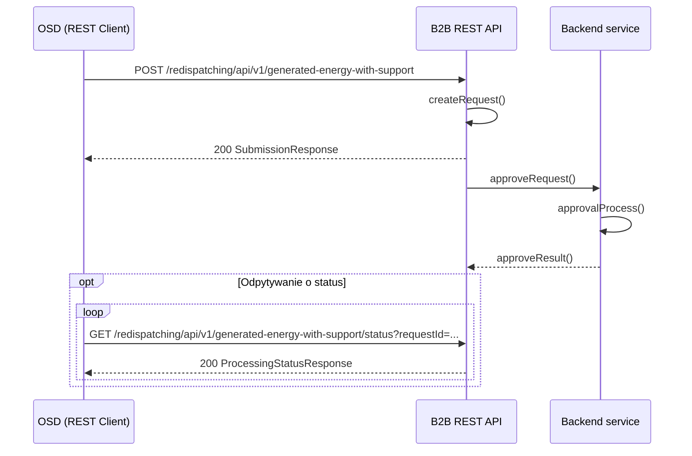

# Wolumen energii wyprodukowanej objętej systemem wsparcia (E_WYK_CERT)

## Opis

Przekazanie informacji o E_WYK_CERT dla MWE, które były redysponowane przez OSD w związku z wydanym poleceniem OSP polegające na podaniu informacji o:
- identyfikatorze mRID (unikalny identyfikator MWE) MWE
- dacie redysponowania wynikającej z polecenia wydanego przez OSP
- E_WYK_CERT — wolumenie energii wyprodukowanej przez instalację wiatrową w przedziale czasowym t, zmierzonym na zaciskach generatorów turbin wiatrowych, wyrażonym w kWh z dokładnością do 2 miejsc po przecinku

Przedziały czasowe wskazują czasy zakończenia kolejnych 15-minutowych przedziałów czasowych t doby, w której zastosowano redysponowanie.

## Uczestnicy

| Rola | Podmiot |
|------|---------|
| Nadawca | OSDp (Operator Systemu Dystrybucyjnego przyłączony do sieci przesyłowej) |
| Odbiorca | OSP (Operator Systemu Przesyłowego) |

## Endpointy API

### POST `/redispatching/api/v1/generated-energy-with-support`

Przesłanie danych o energii certyfikowanej E_WYK_CERT.

**operationId:** `postGeneratedEnergyWithSupport`
**Tag:** Certified Energy

**Ciało zapytania:** `EWykCertCollection` — tablica obiektów `EWykCert`, z których każdy zawiera:
- `mRID` — unikalny identyfikator MWE
- `redispatchDate` — doba redysponowania (date)
- `seriesPeriods` — serie danych z przedziałami czasowymi (rozdzielczość PT15M) i punktami `TimeseriesEWykCert` (position, eWykCert)

| Kod | Opis | Schemat |
|-----|------|---------|
| 200 | Dane przyjęte do przetwarzania | `SubmissionResponse` |
| 400 | Nieprawidłowe dane | `ErrorResponse` |

---

### GET `/redispatching/api/v1/generated-energy-with-support/status`

Pobranie statusu przetwarzania przesłanych danych E_WYK_CERT.

**operationId:** `getGeneratedEnergyWithSupportStatus`
**Tag:** Certified Energy

| Parametr | Typ | Lokalizacja | Wymagany | Opis |
|----------|-----|-------------|:--------:|------|
| `requestId` | string | query | tak | Identyfikator przesłanych danych |

| Kod | Opis | Schemat |
|-----|------|---------|
| 200 | Status przetwarzania | `ProcessingStatusResponse` |
| 400 | Nieprawidłowy identyfikator | — |
| 404 | Nie znaleziono | — |

## Uwierzytelnianie

mTLS — certyfikaty klienckie X.509 podpisane przez zaufany CA operatora.

## Warunki wymagane

- Wydano polecenie bilansowe lub sieciowe OSD w ramach wydanego polecenia OSP
- Komunikat będzie dostępny do godziny 10:00 drugiego dnia po dniu, w którym wystąpiło redysponowanie nierynkowe

## Status obsługi

| Status | Opis |
|--------|------|
| Zgłoszenie przyjęte | Dane o E_WYK_CERT dla MWE korzystających z systemu wsparcia świadectw pochodzenia, które zostały redysponowane przez OSD na polecenie OSP, zostały zarejestrowane w systemie OSP |
| Zgłoszenie odrzucone | Dane o E_WYK_CERT nie zostały zarejestrowane w systemie OSP |

## Diagram sekwencji

