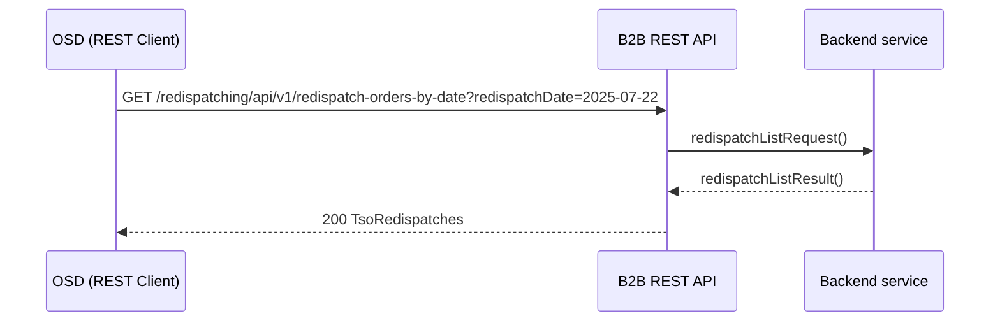

# Historyczne polecenia redysponowania

## Opis

Poinformowanie OSD o wydanych poleceniach bilansowych oraz sieciowych w podanej dobie. Przekazanie informacji o wydanych przez OSP poleceniach redysponowania za dobę poprzedzającą polegające na podaniu informacji:
- Identyfikator polecenia redysponowania
- MWE wchodzące w skład obiektu redysponowania
- zakres czasowy wydanego polecenia (data początku i końca redysponowania), a następnie w serii podanie:
  - zadany maksymalny poziom dopuszczalnej generacji mocy czynnej w miejscu przyłączenia instalacji do sieci OSD, wyrażony w MW z dokładnością do 1 kW podawany w przedziałach czasowych
  - typ polecenia (bilansowy lub sieciowy) podawany w przedziałach czasowych

## Uczestnicy

| Rola | Podmiot |
|------|---------|
| Nadawca | OSP (Operator Systemu Przesyłowego) |
| Odbiorca | OSDp (Operator Systemu Dystrybucyjnego przyłączony do sieci przesyłowej) |

## Endpoint API

### GET `/redispatching/api/v1/redispatch-orders-by-date`

**operationId:** `getRedispatchOrdersByDate`
**Tag:** Redispatch Orders

| Parametr | Typ | Lokalizacja | Wymagany | Opis |
|----------|-----|-------------|:--------:|------|
| `redispatchDate` | string (date) | query | tak | Doba redysponowania |

| Kod | Opis | Schemat |
|-----|------|---------|
| 200 | Lista poleceń redysponowania | `TsoRedispatches` |
| 400 | Nieprawidłowa data | `ErrorResponse` |
| 403 | Odmowa dostępu | `ErrorResponse` |
| 404 | Nie znaleziono poleceń | `ErrorResponse` |

Schemat `TsoRedispatches` to tablica obiektów `TsoRedispatch`, z których każdy zawiera:
- `mRID` — unikalny identyfikator MWE
- `redispatchTable` — tablica `TsoRedispatchTable` z serią danych (przedział czasowy, rozdzielczość PT15M, punkty `TimeseriesTso` z polami: position, pZad, redispatchType)

## Uwierzytelnianie

mTLS — certyfikaty klienckie X.509 podpisane przez zaufany CA operatora.

## Warunki wymagane

- Wydano polecenie bilansowe lub sieciowe dla OSD
- Komunikat będzie przesłany niezwłocznie po zakończeniu doby, w której wydano polecenie

## Status obsługi

| Status | Opis |
|--------|------|
| Zgłoszenie przyjęte | Dane o wydanych poleceniach bilansowych lub sieciowych na MWE należących do Obiektu redysponowania zostały zarejestrowane w systemie OSD |
| Zgłoszenie odrzucone | Dane o wydanych poleceniach nie zostały zarejestrowane w systemie OSD |

## Diagram sekwencji

