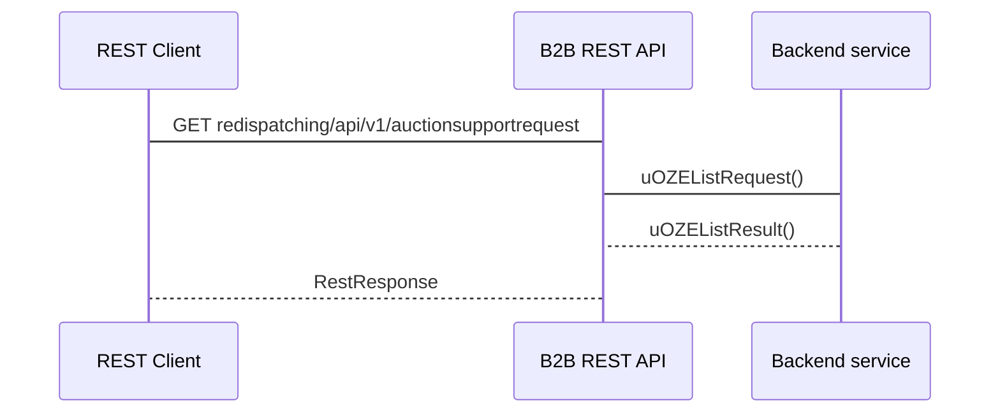
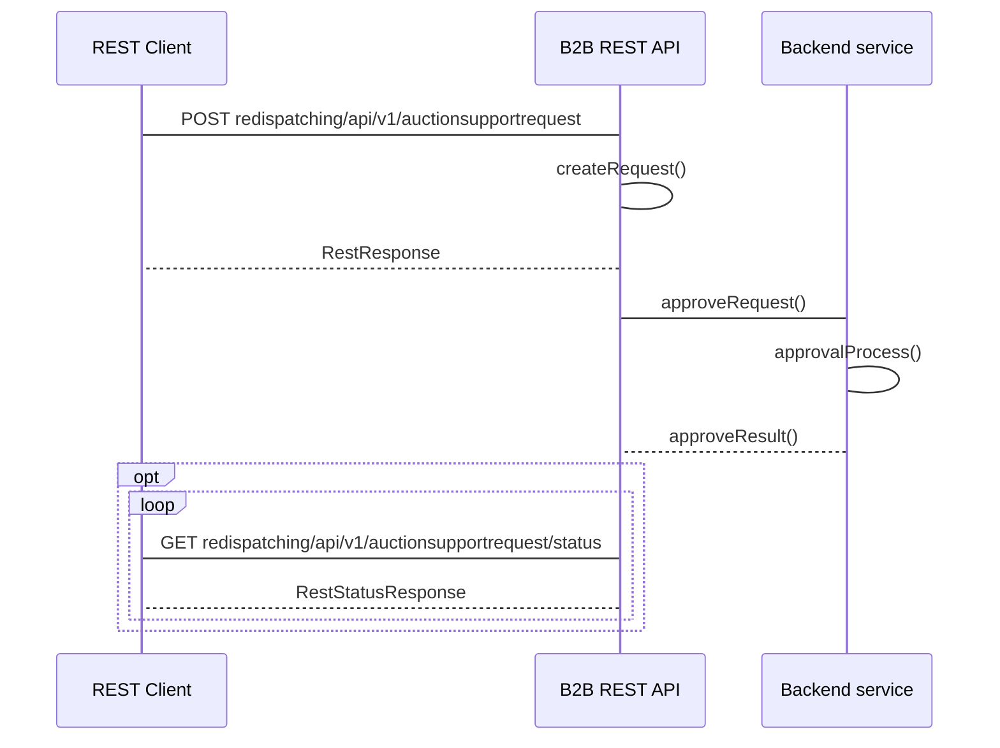

## Zgłoszenia chęci skorzystania z aukcyjnego systemu wsparc (uOZE)

### Zgłoszenia uOZE przekazywane do OSD

#### Adres Rest API
```
- GET redispatching/api/v1/auctionsupportrequest
```

#### Nadawca
Wytwórca
#### Odbiorca
Operator Systemu Dystrybucyjnego przyłaczony do sieci przesyłowej

#### Charakterystyka komunikatu
Przekazanie informacji o zgłoszeniach wynikających z art. 93 ust. 18 Ustawy o OZE, , które złożyli Wytwórcy w aplikacji WOZE po wydanym poleceniu przez OSP, polegające na podaniu informacji o:
- identyfikatorze mRID (Unikalny identyfikator MWE) MWE
- dacie redysponowania wynikającej z polecenia wydanego przez OSP
- w jakim systemie wsparcia powinna zostać rozliczona energia
- jaka część (%) zredukowanej energii powinna zostać rozliczona w danym systemie wsparcia (art. 93 ust. 18 ustawy o odnawialnych źródłach energii (Dz.U.2023.1436))'
- numerze IPA, którego dotyczy system wsparcia: system aukcyjny

Warunki wymagane do rozpoczęcia komunikatu:
Wydano polecenie OSP (bilansowe lub sieciowe) na MWE, któremu przysługuje aukcyjny system wsparcia
Komunikat będzie dostępny do przesłania od pierwszego dnia po wydanym poleceniu

#### Status obsługi komunikatu
**Zgoszenie przyjęte:** Przekazane przez Operatora Systemu Przesyłowego wniosków właścicieli MWE o rozliczenie energii zredukowanej w danym systemie wsparcia, które zawierają się w obiekcie redysponowania, dla którego wydano polecenie OSP, zostały zarejestrowane w systemie OSD

**Zgłoszenie odrzucone:** Wnioski właścicieli MWE o rozliczenie energii zredukowanej w danym systemie wsparcia, które zawierają się w obiekcie redysponowania, dla którego wydano polecenie OSP, nie zostały zarejestrowane w systemie OSD

#### Diagram sekwencji


### Zgłoszenie z uOZE przekazanych do OSD poza systemem WOZE

#### Adres Rest API
```
- POST redispatching/api/v1/auctionsupportrequest
- GET redispatching/api/v1/auctionsupportrequest/status
```

#### Nadawca
Operator Systemu Dystrybucyjnego przyłaczony do sieci przesyłowej 
#### Odbiorca
Operator Systemu Przesyłowego

#### Charakterystyka komunikatu
Przekazanie informacji o zgłoszeniach właścicieli MWE wynikających z Ustawy o OZE, o  rozliczeniu energii zredukowanej w systemie wsparcia, , które złożyli Wytwórcy poza aplikacją WOZE po wydanym poleceniu przez OSP, polegające na podaniu informacji o:
- identyfikatorze mRID (Unikalny identyfikator MWE) MWE
- dacie redysponowania nierynkowego
- w jakim systemie wsparcia powinna zostać rozliczona energia
- jaka część (%) zredukowanej energii powinna zostać rozliczona w danym systemie wsparcia (art. 93 ust. 18 ustawy o odnawialnych źródłach energii (Dz.U.2023.1436))'
- numerze IPA, którego dotyczy system wsparcia: system aukcyjny
- czasie przekazania zgłoszenia do OSD poza systemem WOZE

Warunki wymagane do rozpoczęcia komunikatu:
Wydano polecenie OSP (bilansowe lub sieciowe) na MWE, któremu przysługuje aukcyjny system wsparcia
Komunikat będzie dostępny do przesłania od pierwszego dnia po wydanym poleceniu

#### Status obsługi komunikatu
**Zgoszenie przyjęte:** Przekazane przez Operatora Systemu Dystrybucyjnego wniosków właścicieli MWE o rozliczenie energii zredukowanej w danym systemie wsparcia, które zawierają się w obiekcie redysponowania, dla którego wydano polecenie OSP, zostały zarejestrowane w systemie OSD

**Zgłoszenie odrzucone:** Wnioski właścicieli MWE o rozliczenie energii zredukowanej w danym systemie wsparcia, które zawierają się w obiekcie redysponowania, dla którego wydano polecenie OSP, nie zostały zarejestrowane w systemie OSP

#### Diagram sekwencji
