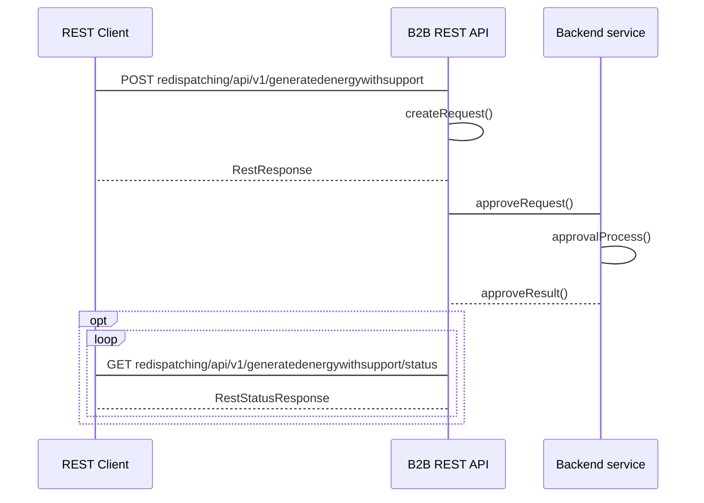

## Wolumen energii wyprodukowanej objętej systemem wsparcia

#### Adres Rest API
```
- POST redispatching/api/v1/generatedenergywithsupport
- GET redispatching/api/v1/generatedenergywithsupport/status
```

#### Nadawca
Operator Systemu Dystrybucyjnego przyłaczony do sieci przesyłowej 
#### Odbiorca
Operator Systemu Przesyłowego

#### Charakterystyka komunikatu
Przekazanie informacji o E_wyk_cert dla MWE, które były redysponowane przez OSD w związku z wydanym poleceniem OSP polegające na podaniu informacji o:
- identyfikatorze mRID (Unikalny identyfikator MWE) MWE
- dacie redysponowania wynikającej z polecenia wydanego przez OSP
- Ewyk_cert - wolumenie energii wyprodukowanej przez instalację wiatrową w przedziale czasowym t, zmierzony na zaciskach generatorów turbin wiatrowych, wyrażony z kWh z dokładnością do 2 miejsc po przecinku + tooltip "Przedziały czasowe podane poniżej wskazują czasy zakończenia kolejnych 15-minutowych przedziałów czasowych t doby, w której zastosowano redysponowanie. W zależności od dokładności urządzeń pomiarowych do przedziału t oznaczonego 00:15:00 może zostać zakwalifikowany pomiar od 00:00:01 do 00:15:00 albo od 00:00:01 do 00:14:59 albo inny obejmujący w maksymalnym zakresie ten przedział"
  
Warunki wymagane do rozpoczęcia komunikatu:
Wydano polecenie bilansowe lub sieciowe OSD w ramach wydanego polecenia OSP
Komunikat będzie dostępny do godziny 10.00 drugiego dnia po dniu, w którym wystąpiło redysponowanie nierynkowe
#### Status obsługi komunikatu
**Zgoszenie przyjęte:** Przekazane przez Operatora Systemu Dystrybucyjnego dane o E_wyk_cert dla MWE, które korzystają z systemu wsparcia świadectw pochodzenia, a które zostały redysponowane przez OSD na polecenie wydane przez OSP zostały zarejestrowane w systemie OSP

**Zgłoszenie odrzucone:** Dane o E_wyk_cert dla MWE, które korzystają z systemu wsparcia świadectw pochodzenia, a które zostały redysponowane przez OSD na polecenie wydane przez OSP nie zostały zarejestrowane w systemie OSP

#### Diagram sekwencji
