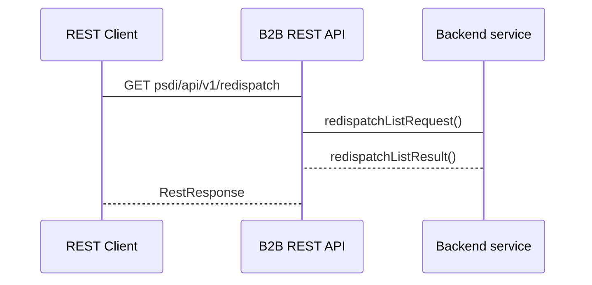

## Polecenia redysponowania
 
### Historia wydanych poleceń redysponowania przez PSE

#### Adres Rest API
```
- GET psdi/api/v1/redispatch
```

#### Nadawca
Operator Systemu Przesyłowego
#### Odbiorca
Operator Systemu Dystrybucyjnego przyłaczony do sieci przesyłowej

#### Charakterystyka komunikatu
Poinformowanie OSD o wydanych poleceniach bilansowych oraz sieciowych w podanej dobie.
Przekazanie informacji o wydanych przez PSE poleceniach redysponowania za dobę poprzedzającą polegające na podaniu informacji:
- MWE wchodzą w skład obiektu redysponowania
- zakres czasowy wydanego polecenia (data początku redysponowania i data końca redysponowania), a następnie w serii podanie:
  - zadany maksymalny poziom dopuszczalnej generacji mocy czynnej w miejscu przyłączenia instalacji do sieci OSD, wyrażony w kW z dokładnością do 1 kW podawany w 15tkach w przedziale czasowym redysponowania
  - typ polecenia (bilansowy lub sieciowy) podawany w 15tkach w przedziale czasowym redysponowania

Warunki wymagane do rozpoczęcia komunikatu:
Wydano polecenie bilansowe lub sieciowe dla OSD
Komunikat będzie przesłany niezwłocznie po zakończeniu doby, w której wydano polecenie
#### Status obsługi komunikatu
**Zgoszenie przyjęte:** Przekazane przez Operatora Systemu Przesyłowego dane o wydanych poleceniach bilansowych lub sieciowych na MWE należących do Obiektu redysponowania zostały zarejestrowane w systemie OSD

**Zgłoszenie odrzucone:** Dane o wydanych poleceniach bilansowych lub sieciowych na MWE należących do Obiektu redysponowania nie zostały zarejestrowane w systemie OSD
	
#### Diagram sekwencji
