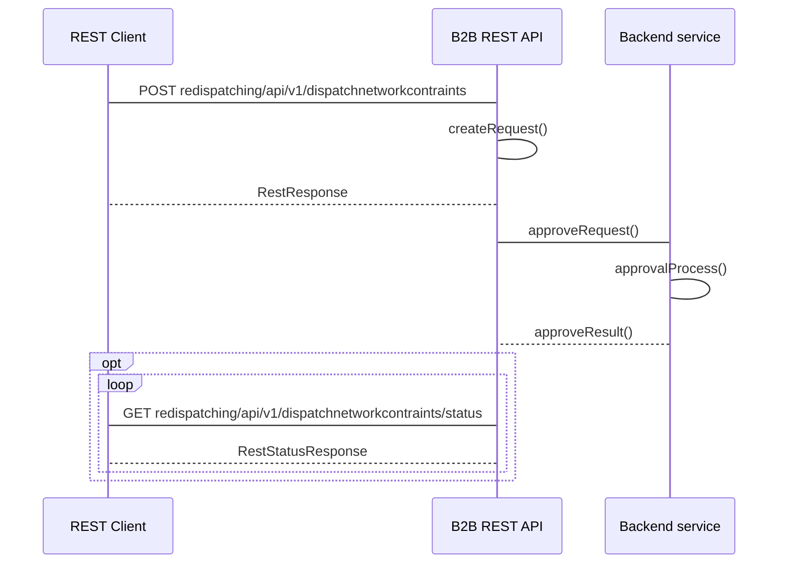

## Ograniczenia w sieci OSD niezwiązane z wydanym poleceniem OSP

#### Adres Rest API
```
- POST redispatching/api/v1/dispatchnetworkcontraints
- GET redispatching/api/v1/dispatchnetworkcontraints/status
```

#### Nadawca
Operator Systemu Dystrybucyjnego przyłaczony do sieci przesyłowej 
#### Odbiorca
Operator Systemu Przesyłowego

#### Charakterystyka komunikatu
Przekazanie informacji o  ograniczeniach występujących w sieci OSD niezwiązanych z wydanymi poleceniami OSP polegające na podaniu informacji o:
- identyfikatorze mRID (Unikalny identyfikator MWE) MWE
- dacie redysponowania wynikającej z polecenia wydanego przez OSP
- maksymalnym poziomie generacji mocy czynnej instalacji zdeterminowanym przyczynami innymi niż wydanym przez OSP poleceniem Redysponowania Nierynkowego, w poszczególnych przedziałach czasowych, wyrażony w kW z dokładnością do 1 kW
  
Warunki wymagane do rozpoczęcia komunikatu:
Wydano polecenie bilansowe lub sieciowe OSD w ramach wydanego polecenia OSP
Komunikat będzie dostępny do przesłania od pierwszego dnia po wydanym poleceniu
#### Status obsługi komunikatu
**Zgoszenie przyjęte:** Przekazane przez Operatora Systemu Dystrybucyjnego dane o ograniczeniach występujących w dobie wydanego polecenia OSP na MWE należących do Obiektu redysponowania zostały zarejestrowane w systemie OSP

**Zgłoszenie odrzucone:** Dane o o ograniczeniach występujących w dobie wydanego polecenia OSP na MWE należących do Obiektu redysponowania nie zostały zarejestrowane w systemie OSP

#### Diagram sekwencji
