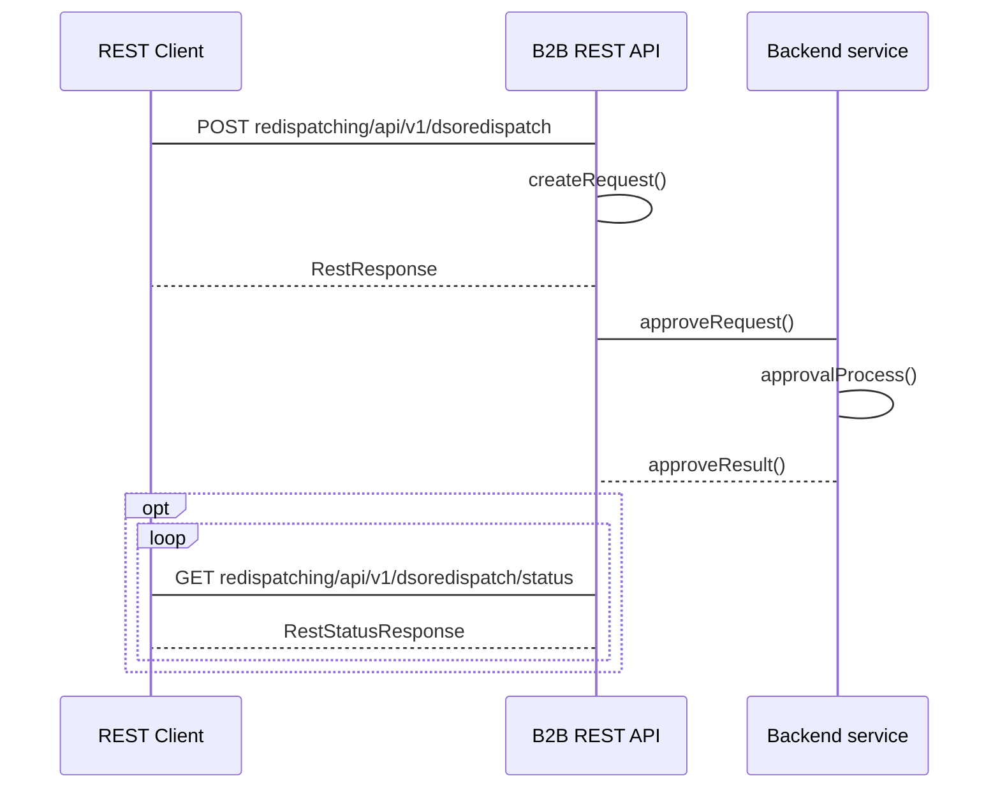

## Polecenia redysponowania

### Wykonanie przez OSD polecenia redukcji wydanej przez OSP
#### Adres Rest API
```
- POST redispatching/api/v1/dsoredispatch
- GET redispatching/api/v1/dsoredispatch/status
```
#### Nadawca
Operator Systemu Dystrybucyjnego przyłaczony do sieci przesyłowej 
#### Odbiorca
Operator Systemu Przesyłowego

#### Charakterystyka komunikatu
Przekazanie informacji o wydanych przez OSD poleceniach redysponowania za dobę poprzedzającą w ramach wydanych poleceń przez OSP polegające na podaniu informacji o:
- identyfikatorze mRID (Unikalny identyfikator MWE) MWE
- dobie redysponowania, a w ramach doby redysponowania podanie 
  - początku redysponowania nierynkowego po stronie instalacji - data i czas
  - końcu redysponowania nierynkowego po stronie instalacji - data i czas
  - zadanym przez OSD, zdeterminowanym wydanym przez OSP poleceniem redysponowania nierynkowego, maksymalnym poziomie dopuszczalenej generacji mocy czynnej w - miejscu przyłączenia instalacji do sieci OSD, wyrażony w kW z dokładnością do 1 kW
  - typie polecenia: bilansowe / sieciowe
  
Warunki wymagane do rozpoczęcia komunikatu:
Wydano polecenie bilansowe lub sieciowe OSD w ramach wydanego polecenia OSP
Komunikat będzie dostępny do przesłania od pierwszego dnia po wydanym poleceniu
#### Status obsługi komunikatu
**Zgoszenie przyjęte:** Przekazane przez Operatora Systemu Dystrybucyjnego dane o wydanych poleceniach bilansowych lub sieciowych na MWE należących do Obiektu redysponowania zostały zarejestrowane w systemie OSP

**Zgłoszenie odrzucone:** Dane o wydanych poleceniach bilansowych lub sieciowych na MWE należących do Obiektu redysponowania nie zostały zarejestrowane w systemie OSP

#### Diagram sekwencji
