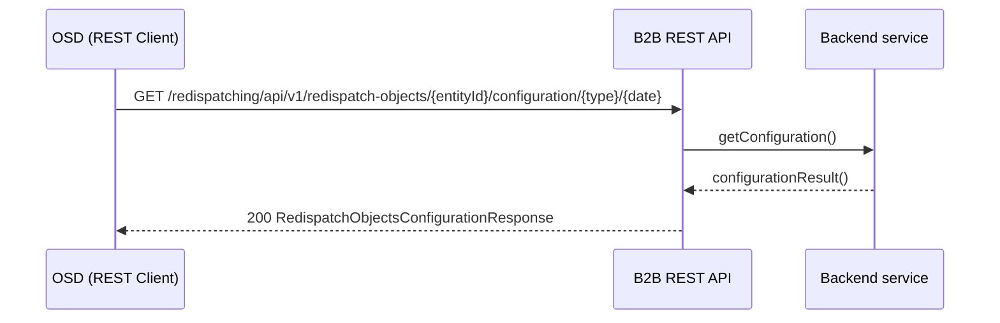

# Konfiguracja obiektów redysponowania

## Opis

Komunikat konfiguracji obiektów redysponowania umożliwia OSD odpytanie OSP o listę obiektów podlegających redysponowaniu i przyłączonych do sieci tego OSD. W odpowiedzi OSP zwraca konfigurację obiektów na dany dzień.

Rozróżnia się następujące typy zapytań:
- **Typ 0** — lista wszystkich obiektów redysponowania danego OSD
- **Typ 1** — lista wszystkich obiektów redysponowania danego OSD wraz z listą zasobów składających się na każdy z tych obiektów
- **Typ 2** — lista zasobów składających się na wskazane obiekty redysponowania (wymagany parametr `objects`)

Komunikat umożliwia odpytanie o stan konfiguracji obiektów na dobę bieżącą (D), dobę następną (D+1) lub datę przeszłą (nie wcześniejszą niż 2 miesiące od doby bieżącej).

Nie jest możliwe zapytanie o konfigurację obiektów spoza sieci danego OSD.

## Uczestnicy

| Rola | Podmiot |
|------|---------|
| Zapytujący | OSDp (Operator Systemu Dystrybucyjnego) |
| Odpowiadający | OSP (Operator Systemu Przesyłowego) |

## Endpoint API

### GET `/redispatching/api/v1/redispatch-objects/{entityId}/configuration/{type}/{date}`

**operationId:** `getRedispatchObjectsConfiguration`
**Tag:** Configuration

| Parametr | Typ | Lokalizacja | Wymagany | Opis |
|----------|-----|-------------|:--------:|------|
| `entityId` | string | path | tak | Identyfikator podmiotu (OSD) |
| `type` | string (enum: `0`, `1`, `2`) | path | tak | Typ zapytania (patrz opis powyżej) |
| `date` | string (date) | path | tak | Doba konfiguracji — stan na wskazany dzień |
| `objects` | array of string (uuid) | query | nie | Lista mRID obiektów redysponowania (dla type=2) |

| Kod | Opis | Schemat |
|-----|------|---------|
| 200 | Konfiguracja obiektów | `RedispatchObjectsConfigurationResponse` |
| 400 | Nieprawidłowe zapytanie | — |
| 404 | Nie znaleziono | — |

### Schemat odpowiedzi `RedispatchObjectsConfigurationResponse`

| Pole | Typ | Opis |
|------|-----|------|
| `type` | string (enum: `0`, `1`, `2`) | Typ zapytania |
| `date` | string (date) | Doba konfiguracji |
| `objects` | array | Lista obiektów redysponowania |

Każdy obiekt zawiera:
- `redispatchingObjectMrid` (uuid) — mRID obiektu redysponowania
- `redispatchingObjectCode` (string, 38 zn.) — biznesowy kod obiektu
- `objectResources` (array, opcjonalnie przy type=1 lub type=2) — lista zasobów:
  - `registeredResourceMrid` (uuid) — mRID zasobu
  - `registeredResourceCode` (string, 36 zn.) — kod zasobu
  - `registeredResourcePRef` (number) — moc referencyjna zasobu

## Uwierzytelnianie

mTLS — certyfikaty klienckie X.509 podpisane przez zaufany CA operatora.

## Status obsługi komunikatu

| Status | Opis |
|--------|------|
| Komunikat przyjęty | Przekazanie odpowiedzi z konfiguracją obiektów redysponowania |
| Komunikat odrzucony | Przekazanie odpowiedzi zawierającej wyniki walidacji będące powodem odrzucenia |

## Diagram sekwencji

