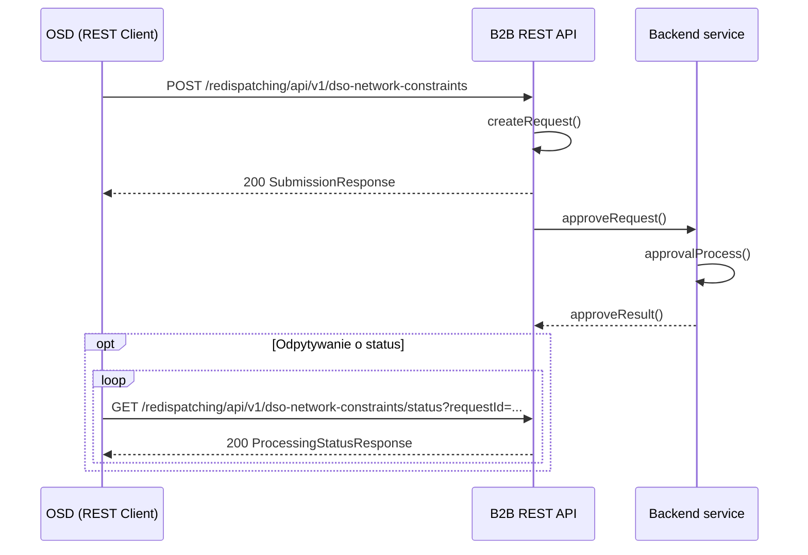

# Ograniczenia w sieci OSD niezwiązane z wydanym poleceniem OSP

## Opis

Przekazanie informacji o ograniczeniach występujących w sieci OSD niezwiązanych z wydanymi poleceniami OSP polegające na podaniu informacji o:
- identyfikatorze mRID (unikalny identyfikator MWE) MWE
- dacie redysponowania wynikającej z polecenia wydanego przez OSP
- maksymalnym poziomie generacji mocy czynnej instalacji zdeterminowanym przyczynami innymi niż wydanym przez OSP poleceniem redysponowania nierynkowego, w poszczególnych przedziałach czasowych, wyrażonym w kW z dokładnością do 1 MW

## Uczestnicy

| Rola | Podmiot |
|------|---------|
| Nadawca | OSDp (Operator Systemu Dystrybucyjnego przyłączony do sieci przesyłowej) |
| Odbiorca | OSP (Operator Systemu Przesyłowego) |

## Endpointy API

### POST `/redispatching/api/v1/dso-network-constraints`

Przesłanie ograniczeń sieciowych OSD.

**operationId:** `postDispatchNetworkConstraints`
**Tag:** Network Constraints

**Ciało zapytania:** `DsoNetworkConstraints` — tablica obiektów `NetworkConstraint`, z których każdy zawiera:
- `mRID` — unikalny identyfikator MWE
- `redispatchDate` — doba redysponowania (date)
- `seriesPeriods` — serie danych z przedziałami czasowymi (rozdzielczość PT15M) i punktami `TimeseriesPZadDso` (position, pZadDso)

| Kod | Opis | Schemat |
|-----|------|---------|
| 200 | Dane przyjęte do przetwarzania | `SubmissionResponse` |
| 400 | Nieprawidłowe dane | `ErrorResponse` |

---

### GET `/redispatching/api/v1/dso-network-constraints/status`

Pobranie statusu przetwarzania przesłanych ograniczeń sieciowych.

**operationId:** `getDispatchNetworkConstraintsStatus`
**Tag:** Network Constraints

| Parametr | Typ | Lokalizacja | Wymagany | Opis |
|----------|-----|-------------|:--------:|------|
| `requestId` | string | query | tak | Identyfikator przesłanych danych |

| Kod | Opis | Schemat |
|-----|------|---------|
| 200 | Status przetwarzania | `ProcessingStatusResponse` |
| 400 | Nieprawidłowy identyfikator | — |
| 404 | Nie znaleziono | — |

## Uwierzytelnianie

mTLS — certyfikaty klienckie X.509 podpisane przez zaufany CA operatora.

## Warunki wymagane

- Wydano polecenie bilansowe lub sieciowe OSD w ramach wydanego polecenia OSP
- Komunikat będzie dostępny do przesłania od pierwszego dnia po wydanym poleceniu

## Status obsługi

| Status | Opis |
|--------|------|
| Zgłoszenie przyjęte | Dane o ograniczeniach występujących w dobie wydanego polecenia OSP na MWE należących do Obiektu redysponowania zostały zarejestrowane w systemie OSP |
| Zgłoszenie odrzucone | Dane o ograniczeniach nie zostały zarejestrowane w systemie OSP |

## Diagram sekwencji

