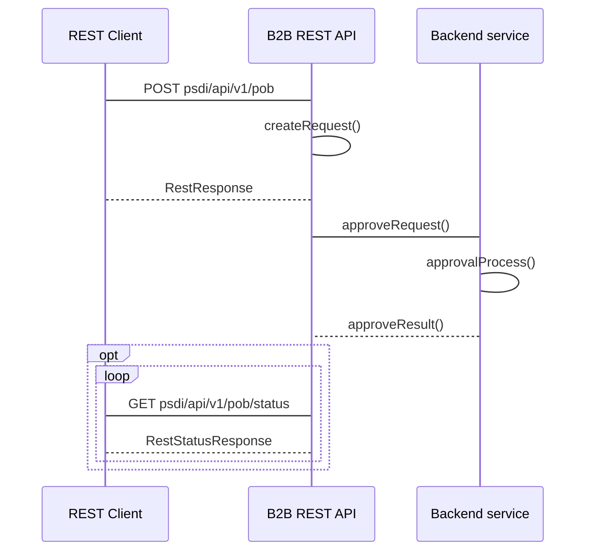

## Zmiana POB dla pojedynczego MWE 
#### Adres Rest API

```
- POST psdi/api/v1/pob
- GET psdi/api/v1/pob/status
```

#### Nadawca
Operator Systemu Dystrybucyjnego przyłaczony do sieci przesyłowej 

#### Odbiorca
Operator Systemu Przesyłowego

#### Charakterystyka komunikatu
Przekazanie informacji o zmianie przypisania POB do pojedynczego MWE polegające na podaniu informacji o:
- identyfikatorze mRID (Unikalny identyfikator MWE) MWE
- nazwie podmiotu odpowiedzialnego za bilansowanie
- numerze NIP podmiotu odpowiedzialnego za bilansowanie
- dacie obowiązywania od POB dla MWE

Warunki wymagane do rozpoczęcia komunikatu:
Zmiana przypisania POB dla MWE
Komunikat będzie dostępny do przesłania od daty zmiany przypisania POB do MWE

#### Status obsługi komunikatu
**Zgoszenie przyjęte:** Zmiana POB dla MWE została zarejestrowana w systemie OSP.

**Zgłoszenie odrzucone:** Zmiana POB dla MWE nie została zarejestrowana w systemie OSP.

#### Diagram sekwencji

