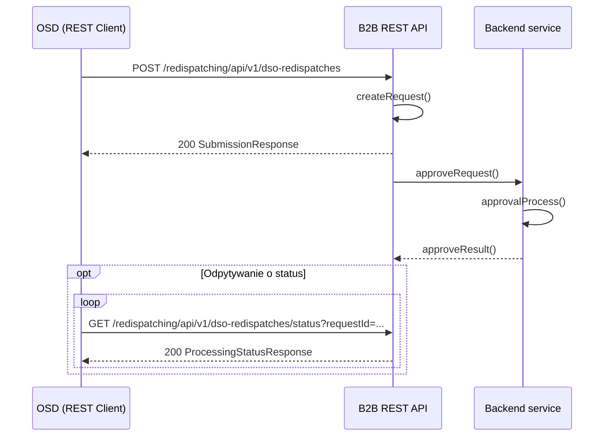

# Polecenia redysponowania wydane przez OSD

## Opis

Przekazanie informacji o wydanych przez OSD poleceniach redysponowania za dobę poprzedzającą w ramach wydanych poleceń przez OSP polegające na podaniu informacji o:
- identyfikatorze mRID (unikalny identyfikator MWE) MWE
- dobie redysponowania, a w ramach doby:
  - początku redysponowania nierynkowego po stronie instalacji — data i czas
  - końcu redysponowania nierynkowego po stronie instalacji — data i czas
  - zadanym przez OSD maksymalnym poziomie dopuszczalnej generacji mocy czynnej w miejscu przyłączenia instalacji do sieci OSD, wyrażonym w kW z dokładnością do 1 MW
  - typie polecenia: bilansowe / sieciowe

## Uczestnicy

| Rola | Podmiot |
|------|---------|
| Nadawca | OSDp (Operator Systemu Dystrybucyjnego przyłączony do sieci przesyłowej) |
| Odbiorca | OSP (Operator Systemu Przesyłowego) |

## Endpointy API

### POST `/redispatching/api/v1/dso-redispatches`

Przesłanie listy poleceń redysponowania wydanych przez OSD.

**operationId:** `postDsoRedispatches`
**Tag:** DSO Redispatch

**Ciało zapytania:** `DsoRedispatches` — tablica obiektów `DsoRedispatch`, z których każdy zawiera:
- `mRID` — unikalny identyfikator MWE
- `redispatchDate` — doba redysponowania (date)
- `redispatchTable` — tablica `DsoRedispatchTable` (redispatchingTimeBegin, redispatchingTimeEnd, pZad, redispatchType)

| Kod | Opis | Schemat |
|-----|------|---------|
| 200 | Dane przyjęte do przetwarzania | `SubmissionResponse` |
| 400 | Nieprawidłowe dane | `ErrorResponse` |

---

### GET `/redispatching/api/v1/dso-redispatches/status`

Pobranie statusu przetwarzania przesłanych poleceń OSD.

**operationId:** `getDsoRedispatchesStatus`
**Tag:** DSO Redispatch

| Parametr | Typ | Lokalizacja | Wymagany | Opis |
|----------|-----|-------------|:--------:|------|
| `requestId` | string | query | tak | Identyfikator przesłanych danych |

| Kod | Opis | Schemat |
|-----|------|---------|
| 200 | Status przetwarzania | `ProcessingStatusResponse` |
| 400 | Nieprawidłowy identyfikator | — |
| 404 | Nie znaleziono | — |

## Uwierzytelnianie

mTLS — certyfikaty klienckie X.509 podpisane przez zaufany CA operatora.

## Warunki wymagane

- Wydano polecenie bilansowe lub sieciowe OSD w ramach wydanego polecenia OSP
- Komunikat będzie dostępny do przesłania od pierwszego dnia po wydanym poleceniu

## Status obsługi

| Status | Opis |
|--------|------|
| Zgłoszenie przyjęte | Dane o wydanych poleceniach bilansowych lub sieciowych na MWE należących do Obiektu redysponowania zostały zarejestrowane w systemie OSP |
| Zgłoszenie odrzucone | Dane o wydanych poleceniach nie zostały zarejestrowane w systemie OSP |

## Diagram sekwencji

