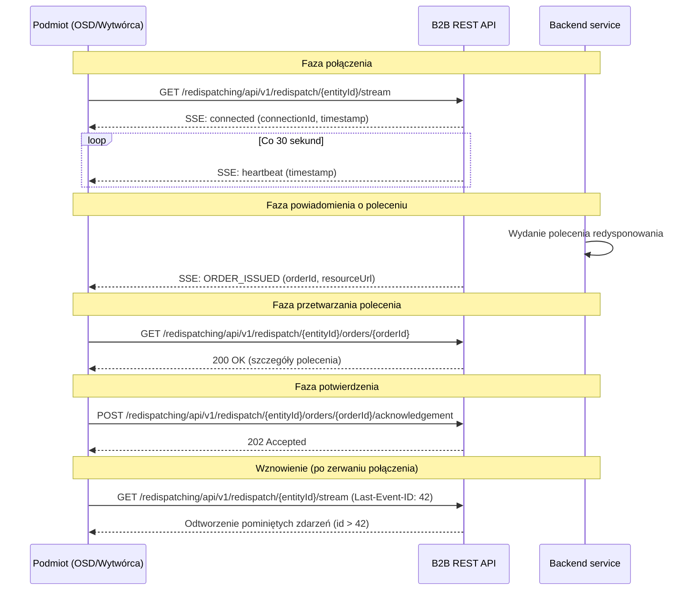

# Polecenia redysponowania (SSE + REST)

## Opis

Operator Systemu Przesyłowego prowadząc ruch Krajowego Systemu Elektroenergetycznego (KSE) w sytuacji niezbilansowania KSE (tj. przypadku, w którym produkcja energii elektrycznej jest wyższa od krajowego zużycia) oraz przy braku innych środków dla zbilansowania KSE, w szczególności środków rynkowych, wydaje polecenia nierynkowego redysponowania dla instalacji OZE tworzących obiekty redysponowania.

Komunikacja odbywa się w czasie rzeczywistym za pomocą **Server-Sent Events (SSE)** dla powiadomień oraz **REST/JSON** dla wymiany danych.

Jeśli polecenie redysponowania dotyczy obiektów przyłączonych do sieci dystrybucyjnej różnych OSD, to wydane polecenie zostanie przekazane osobnymi komunikatami do każdego z OSD, których obiekty są redysponowane i z odpowiednim zestawem danych tylko dla tych obiektów.

Jeśli polecenie redysponowania dotyczy obiektu przyłączonego do sieci przesyłowej, a dany obiekt nie jest zintegrowany z systemem SCADA, to wydane polecenie zostanie przekazane kanałem PSDI do Wytwórcy tego obiektu.

Komunikat zawiera podany okres wydanego polecenia wraz z listą obiektów redysponowania, których dotyczy. Dla każdego obiektu przekazywany jest zestaw danych — w szczególności maksymalne i minimalne wartości generacji/rozładowania określone ze względu na redysponowanie — w podziale na wskazane podokresy.

## Uczestnicy

| Rola | Podmiot |
|------|---------|
| Nadawca poleceń | OSP (Operator Systemu Przesyłowego) |
| Odbiorca poleceń | OSDp (Operator Systemu Dystrybucyjnego), Wytwórca przyłączony do sieci OSP |

## Przebieg workflow

1. Klient łączy się ze strumieniem SSE (`GET .../redispatch/{entityId}/stream`)
2. Serwer wysyła zdarzenie `connected` potwierdzające połączenie
3. Co 30 sekund serwer wysyła zdarzenie `heartbeat` podtrzymujące połączenie
4. Gdy OSP wyda polecenie redysponowania, serwer wysyła zdarzenie `ORDER_ISSUED` z identyfikatorem polecenia i adresem URL do pobrania szczegółów
5. Klient pobiera szczegóły polecenia (`GET .../orders/{redispatchOrderId}`)
6. Klient przesyła potwierdzenie odbioru ze statusem `RECEIVED` (`POST .../acknowledgement`)
7. Klient przesyła decyzję: `ACCEPTED` (przyjęcie do realizacji) lub `REJECTED` (brak możliwości wykonania)

**Wznowienie połączenia:** W przypadku zerwania połączenia SSE, klient MUSI ponownie połączyć się z nagłówkiem `Last-Event-ID` zawierającym ID ostatniego otrzymanego zdarzenia. Serwer wznowi transmisję od pominiętych zdarzeń.

## Endpointy API

### GET `/redispatching/api/v1/redispatch/{entityId}/stream`

Otwarcie strumienia Server-Sent Events (SSE) dla danego podmiotu.

| Parametr | Typ | Lokalizacja | Wymagany | Opis |
|----------|-----|-------------|:--------:|------|
| `entityId` | string | path | tak | 5-znakowy identyfikator podmiotu |
| `Last-Event-ID` | string | header | nie | ID ostatniego otrzymanego zdarzenia (do wznowienia) |

**operationId:** `subscribeToEntityStream`
**Tag:** SSE Streaming
**Content-Type:** `text/event-stream`

#### Typy zdarzeń SSE

| Zdarzenie | Opis | Częstotliwość |
|-----------|------|---------------|
| `connected` | Potwierdzenie nawiązania połączenia SSE | Raz po połączeniu |
| `heartbeat` | Podtrzymanie połączenia | Co 30 sekund |
| `ORDER_ISSUED` | Powiadomienie o nowym poleceniu redysponowania | Gdy wydano polecenie |

Przykłady zdarzeń:
```json
// connected
{"eventType": "connected", "connectionId": "550e8400-e29b-41d4-a716-446655440000", "timestamp": "2025-07-22T08:00:00Z"}

// heartbeat
{"eventType": "heartbeat", "timestamp": "2025-07-22T08:00:30Z"}

// ORDER_ISSUED
{"eventType": "ORDER_ISSUED", "redispatchOrderId": "1/I/22.07.2025", "entityId": "ENT01", "timestamp": "2025-07-22T08:01:00Z", "resourceUrl": "/redispatch/ENT01/orders/1%2FI%2F22.07.2025"}
```

---

### GET `/redispatching/api/v1/redispatch/{entityId}/orders/{redispatchOrderId}`

Pobranie pełnych szczegółów technicznych polecenia redysponowania.

| Parametr | Typ | Lokalizacja | Wymagany | Opis |
|----------|-----|-------------|:--------:|------|
| `entityId` | string | path | tak | Identyfikator podmiotu |
| `redispatchOrderId` | string | path | tak | Biznesowy ID polecenia (URL-encoded, np. `1%2FI%2F22.07.2025`) |

**operationId:** `getRedispatchOrderDetails`
**Tag:** Redispatch Orders

| Kod | Opis | Schemat |
|-----|------|---------|
| 200 | Szczegóły polecenia | `RedispatchOrder` |
| 404 | Polecenie nie znalezione | — |

Schemat `RedispatchOrder` zawiera:
- `redispatchOrderId` — biznesowy ID polecenia (np. `1/I/22.07.2025`)
- `entityId` — 5-znakowy identyfikator podmiotu
- `issueOrderTs` — znacznik czasu wydania polecenia
- `isInformational` — czy polecenie jest tylko informacyjne (zostało wydane innym kanałem)
- `redispatchOrderReason` — cel: `B` (bilansowe), `S` (sieciowe)
- `redispatchOrderPeriod` — okres polecenia (`startDt`, `endDt`)
- `redispatchOrders` — tablica szczegółów technicznych (`RedispatchOrderItem`), każdy zawierający:
  - `redispatchingObjectMrid` — mRID obiektu
  - `measurementUnit` — jednostka (MAW)
  - `seriesPeriods` — serie danych z punktami (`SeriesPoint`: position, quantityMax, quantityMin)

---

### POST `/redispatching/api/v1/redispatch/{entityId}/orders/{redispatchOrderId}/acknowledgement`

Przesłanie potwierdzenia odbioru lub decyzji dotyczącej polecenia redysponowania.

| Parametr | Typ | Lokalizacja | Wymagany | Opis |
|----------|-----|-------------|:--------:|------|
| `entityId` | string | path | tak | Identyfikator podmiotu |
| `redispatchOrderId` | string | path | tak | Biznesowy ID polecenia |

**operationId:** `postRedispatchOrderAcknowledgement`
**Tag:** Redispatch Orders

**Ciało zapytania:** `RedispatchAcknowledgement`

| Pole | Typ | Wymagane | Opis |
|------|-----|:--------:|------|
| `redispatchOrderId` | string | tak | Odwołanie do ID polecenia |
| `entityId` | string (5 zn.) | tak | Identyfikator podmiotu |
| `status` | string (enum) | tak | `RECEIVED`, `ACCEPTED`, `REJECTED` |
| `reason` | string (max 512) | nie | Komentarz do decyzji |

| Kod | Opis |
|-----|------|
| 202 | Potwierdzenie przyjęte do przetwarzania |
| 400 | Nieprawidłowy format potwierdzenia |

Trzy etapy odpowiedzi:
1. **Potwierdzenie odbioru** — status `RECEIVED` wysłany niezwłocznie po pobraniu szczegółów
2. **Przyjęcie** — status `ACCEPTED` jeśli polecenie może być zrealizowane
3. **Odrzucenie** — status `REJECTED` jeśli brak możliwości realizacji (z opcjonalnym polem `reason`)

## Informacja o poleceniu redysponowania (SCADA)

Komunikat informacji o wydaniu polecenia redysponowania przekazywany jest do Wytwórcy przyłączonego do sieci przesyłowej, który jest zintegrowany z systemem SCADA i przy pomocy tego systemu redysponowany.

Zakres danych zawartych w komunikacie informacji o wydaniu polecenia jest tożsamy z zakresem danych wydawanych poleceń i **nie stanowi polecenia redysponowania** — ma charakter wyłącznie informacyjny.

Wytwórca otrzymuje te same zdarzenia SSE (`ORDER_ISSUED`) i może pobrać szczegóły polecenia, ale nie jest zobowiązany do przesłania potwierdzenia.

## Uwierzytelnianie

mTLS — certyfikaty klienckie X.509 podpisane przez zaufany CA operatora.

## Status obsługi komunikatu

| Status | Opis |
|--------|------|
| Komunikat przyjęty | Przekazanie technicznej odpowiedzi zawierającej informację o przyjęciu komunikatu |
| Komunikat odrzucony | Przekazanie technicznej odpowiedzi zawierającej wyniki walidacji poprawności będące powodem odrzucenia |

## Diagram sekwencji


