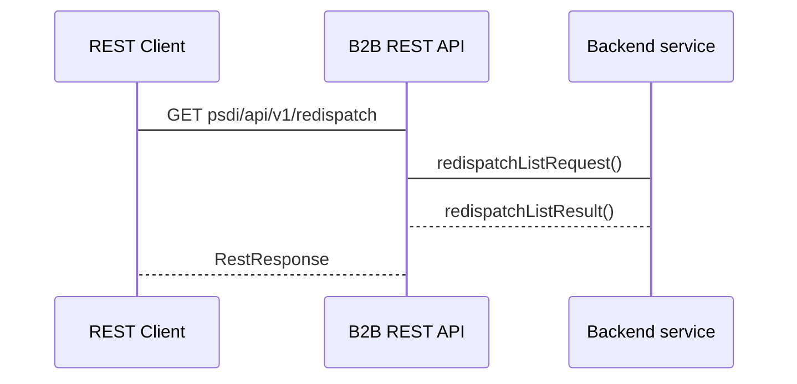
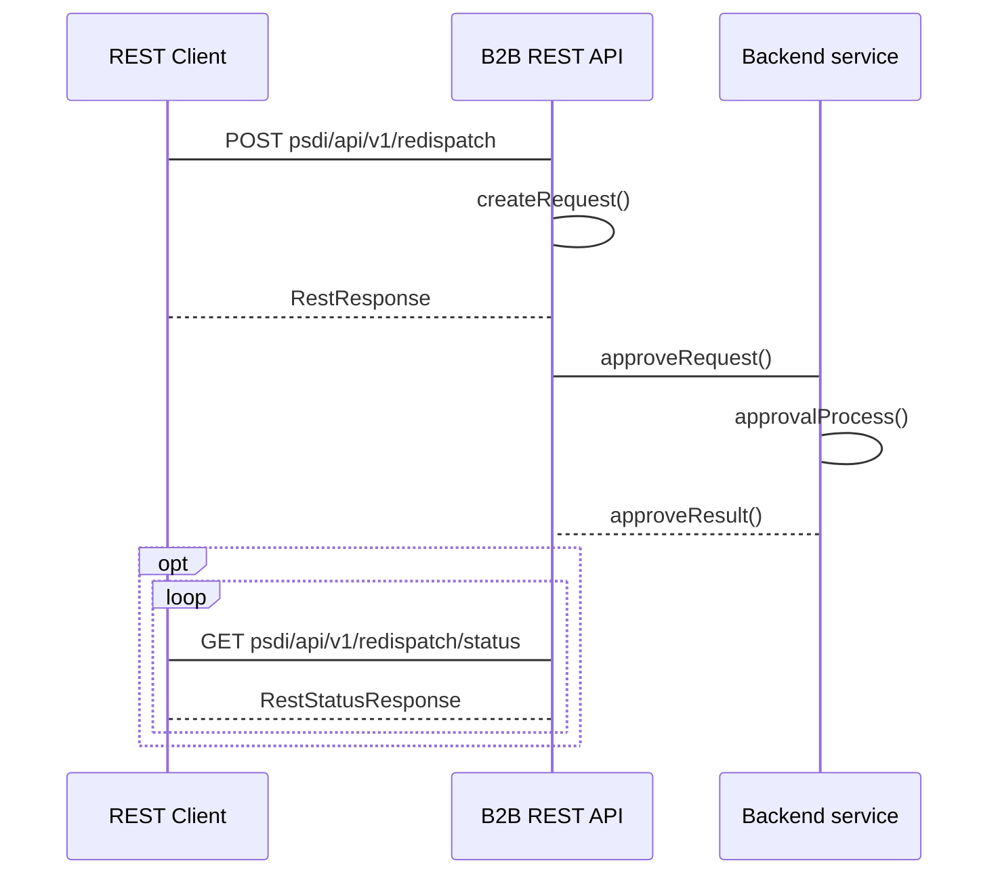

## Polecenia redukcji
 
### Historia wydanych poleceń redukcji przez PSE

#### Adres Rest API
```
- GET psdi/api/v1/redispatch
```

#### Nadawca
Operator Systemu Przesyłowego
#### Odbiorca
Operator Systemu Dystrybucyjnego przyłaczony do sieci przesyłowej

#### Charakterystyka komunikatu
Poinformowanie OSD o wydanych poleceniach bilansowych oraz sieciowych w podanej dobie.
Przekazanie informacji o wydanych przez PSE poleceniach redysponowania za dobę poprzedzającą polegające na podaniu informacji:
- MWE wchodzą w skład obiektu redysponowania
- zakres czasowy wydanego polecenia (data początku redysponowania i data końca redysponowania), a następnie w serii podanie:
  - zadany maksymalny poziom dopuszczalnej generacji mocy czynnej w miejscu przyłączenia instalacji do sieci OSD, wyrażony w kW z dokładnością do 1 kW podawany w 15tkach w przedziale czasowym redysponowania
  - typ polecenia (bilansowy lub sieciowy) podawany w 15tkach w przedziale czasowym redysponowania

Warunki wymagane do rozpoczęcia komunikatu:
Wydano polecenie bilansowe lub sieciowe dla OSD
Komunikat będzie przesłany niezwłocznie po zakończeniu doby, w której wydano polecenie
#### Status obsługi komunikatu
**Zgoszenie przyjęte:** Przekazane przez Operatora Systemu Przesyłowego dane o wydanych poleceniach bilansowych lub sieciowych na MWE należących do Obiektu redysponowania zostały zarejestrowane w systemie OSD

**Zgłoszenie odrzucone:** Dane o wydanych poleceniach bilansowych lub sieciowych na MWE należących do Obiektu redysponowania nie zostały zarejestrowane w systemie OSD
	
#### Diagram sekwencji


### Wykonanie przez OSD polecenia redukcji wydanej przez OSP
#### Adres Rest API
```
- POST psdi/api/v1/redispatch
- GET psdi/api/v1/redispatch/status
```
#### Nadawca
Operator Systemu Dystrybucyjnego przyłaczony do sieci przesyłowej 
#### Odbiorca
Operator Systemu Przesyłowego

#### Charakterystyka komunikatu
Przekazanie informacji o wydanych przez OSD poleceniach redysponowania za dobę poprzedzającą w ramach wydanych poleceń przez OSP polegające na podaniu informacji o:
- identyfikatorze mRID (Unikalny identyfikator MWE) MWE
- dobie redysponowania, a w ramach doby redysponowania podanie 
  - początku redysponowania nierynkowego po stronie instalacji - data i czas
  - końcu redysponowania nierynkowego po stronie instalacji - data i czas
  - zadanym przez OSD, zdeterminowanym wydanym przez OSP poleceniem redysponowania nierynkowego, maksymalnym poziomie dopuszczalenej generacji mocy czynnej w - miejscu przyłączenia instalacji do sieci OSD, wyrażony w kW z dokładnością do 1 kW
  - typie polecenia: bilansowe / sieciowe
  
Warunki wymagane do rozpoczęcia komunikatu:
Wydano polecenie bilansowe lub sieciowe OSD w ramach wydanego polecenia OSP
Komunikat będzie dostępny do przesłania od pierwszego dnia po wydanym poleceniu
#### Status obsługi komunikatu
**Zgoszenie przyjęte:** Przekazane przez Operatora Systemu Dystrybucyjnego dane o wydanych poleceniach bilansowych lub sieciowych na MWE należących do Obiektu redysponowania zostały zarejestrowane w systemie OSP

**Zgłoszenie odrzucone:** Dane o wydanych poleceniach bilansowych lub sieciowych na MWE należących do Obiektu redysponowania nie zostały zarejestrowane w systemie OSP

#### Diagram sekwencji
