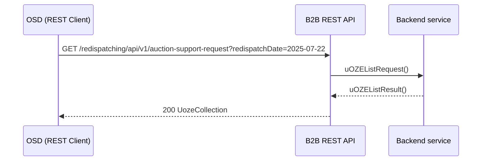
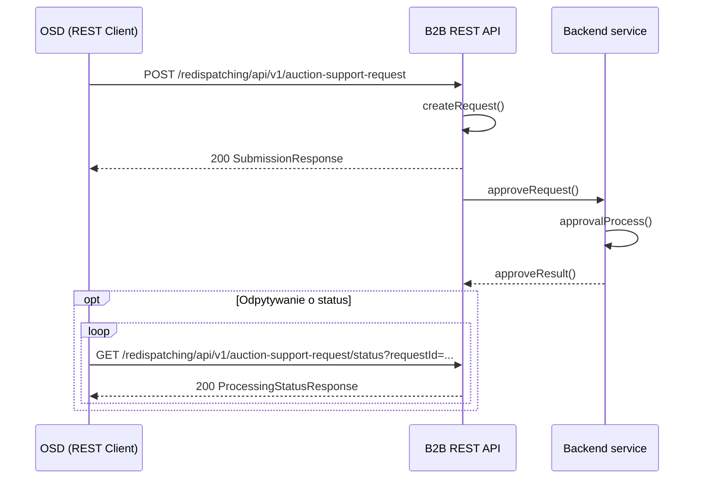

# Zgłoszenia chęci skorzystania z aukcyjnego systemu wsparcia (uOZE)

## Opis

Komunikat dotyczy zgłoszenia informacji wynikającej z art. 93 ust. 18 Ustawy o odnawialnych źródłach energii (Dz.U.2023.1436) o chęci skorzystania z systemu wsparcia przez MWE. Obejmuje dwa warianty przepływu danych.

## Uczestnicy

**Wariant 1 (zgłoszenia z WOZE):**
| Rola | Podmiot |
|------|---------|
| Nadawca | Wytwórca (poprzez aplikację WOZE) |
| Odbiorca | OSDp (Operator Systemu Dystrybucyjnego) |

**Wariant 2 (zgłoszenia poza WOZE):**
| Rola | Podmiot |
|------|---------|
| Nadawca | OSDp (Operator Systemu Dystrybucyjnego) |
| Odbiorca | OSP (Operator Systemu Przesyłowego) |

## Endpointy API

### Wariant 1: Zgłoszenia uOZE przekazywane do OSD przez system WOZE

#### GET `/redispatching/api/v1/auction-support-request`

Pobranie zgłoszeń uOZE przekazanych do OSD przez system WOZE.

**operationId:** `getAuctionSupportRequest`
**Tag:** Auction Support

| Parametr | Typ | Lokalizacja | Wymagany | Opis |
|----------|-----|-------------|:--------:|------|
| `redispatchDate` | string (date) | query | tak | Doba redysponowania |

| Kod | Opis | Schemat |
|-----|------|---------|
| 200 | Lista zgłoszeń uOZE | `UozeCollection` |
| 400 | Nieprawidłowe zapytanie | — |
| 404 | Nie znaleziono | — |

Przekazanie informacji o zgłoszeniach właścicieli MWE z aplikacji WOZE po wydanym poleceniu przez OSP, polegające na podaniu informacji o:
- identyfikatorze mRID (unikalny identyfikator MWE) MWE
- dacie redysponowania wynikającej z polecenia wydanego przez OSP
- w jakim systemie wsparcia powinna zostać rozliczona energia
- jaka część (%) zredukowanej energii powinna zostać rozliczona w danym systemie wsparcia
- numerze IPA, którego dotyczy system wsparcia

---

### Wariant 2: Zgłoszenia uOZE przekazanych do OSD poza systemem WOZE

#### POST `/redispatching/api/v1/auction-support-request`

Przesłanie zgłoszeń uOZE złożonych poza aplikacją WOZE.

**operationId:** `postAuctionSupportRequest`
**Tag:** Auction Support

**Ciało zapytania:** `UozeCollection` — tablica obiektów `Uoze`, z których każdy zawiera:
- `mRID` — unikalny identyfikator MWE
- `redispatchDate` — doba redysponowania (date)
- `notificationDate` — data powiadomienia OSD (date)
- `supportingSystem` — system wsparcia: `auction`, `auctionWith`, `greenCertificate`
- `energy` — % zredukowanej energii do rozliczenia w danym systemie wsparcia
- `ipaNumber` — numer IPA

| Kod | Opis | Schemat |
|-----|------|---------|
| 200 | Dane przyjęte do przetwarzania | `SubmissionResponse` |
| 400 | Nieprawidłowe dane | `ErrorResponse` |

---

#### GET `/redispatching/api/v1/auction-support-request/status`

Pobranie statusu przetwarzania przesłanych zgłoszeń uOZE.

**operationId:** `getAuctionSupportRequestStatus`
**Tag:** Auction Support

| Parametr | Typ | Lokalizacja | Wymagany | Opis |
|----------|-----|-------------|:--------:|------|
| `requestId` | string | query | tak | Identyfikator przesłanych danych |

| Kod | Opis | Schemat |
|-----|------|---------|
| 200 | Status przetwarzania | `ProcessingStatusResponse` |
| 400 | Nieprawidłowy identyfikator | — |
| 404 | Nie znaleziono | — |

## Uwierzytelnianie

mTLS — certyfikaty klienckie X.509 podpisane przez zaufany CA operatora.

## Warunki wymagane

- Wydano polecenie OSP (bilansowe lub sieciowe) na MWE, któremu przysługuje aukcyjny system wsparcia
- Komunikat będzie dostępny do przesłania od pierwszego dnia po wydanym poleceniu

## Status obsługi

| Status | Opis |
|--------|------|
| Zgłoszenie przyjęte | Wnioski właścicieli MWE o rozliczenie energii zredukowanej w danym systemie wsparcia zostały zarejestrowane |
| Zgłoszenie odrzucone | Wnioski właścicieli MWE o rozliczenie energii zredukowanej w danym systemie wsparcia nie zostały zarejestrowane |

## Diagramy sekwencji

### Wariant 1 — Pobranie zgłoszeń z WOZE

### Wariant 2 — Przesłanie zgłoszeń spoza WOZE

