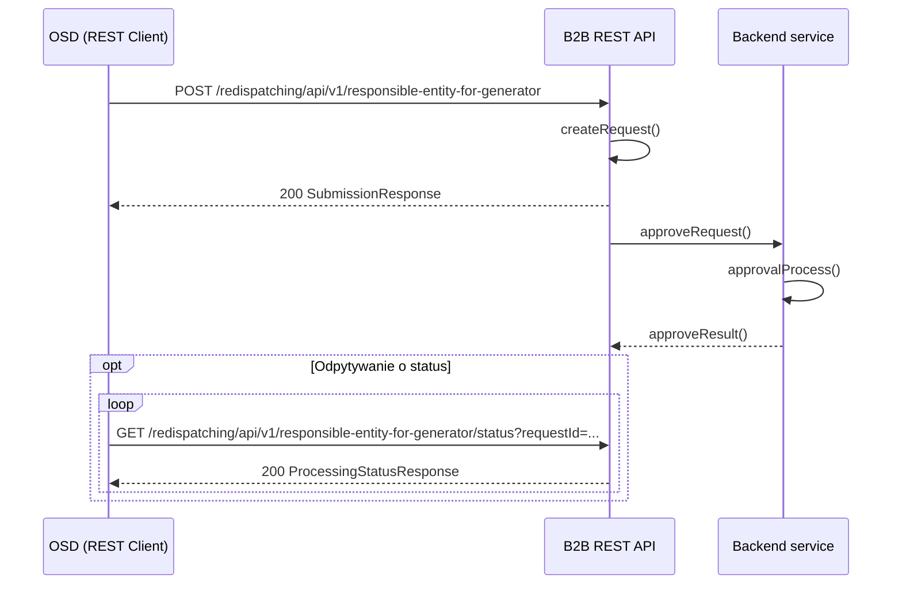

# Zmiana podmiotu odpowiedzialnego za bilansowanie (POB) dla pojedynczego MWE

## Opis

Przekazanie informacji o zmianie przypisania POB do pojedynczego MWE polegające na podaniu informacji o:
- identyfikatorze mRID (unikalny identyfikator MWE) MWE
- nazwie podmiotu odpowiedzialnego za bilansowanie
- numerze NIP podmiotu odpowiedzialnego za bilansowanie
- dacie obowiązywania od POB dla MWE

## Uczestnicy

| Rola | Podmiot |
|------|---------|
| Nadawca | OSDp (Operator Systemu Dystrybucyjnego przyłączony do sieci przesyłowej) |
| Odbiorca | OSP (Operator Systemu Przesyłowego) |

## Endpointy API

### POST `/redispatching/api/v1/responsible-entity-for-generator`

Przesłanie informacji o zmianie POB dla MWE.

**operationId:** `postResponsibleSubjectForGenerator`
**Tag:** Balancing Entity

**Ciało zapytania:** `PobCollection` — tablica obiektów `Pob`, z których każdy zawiera:
- `mRID` — unikalny identyfikator MWE
- `pobName` — nazwa podmiotu odpowiedzialnego za bilansowanie
- `pobNIP` — NIP podmiotu odpowiedzialnego za bilansowanie
- `pobDate` — data od kiedy POB pełni funkcję dla MWE (date)

| Kod | Opis | Schemat |
|-----|------|---------|
| 200 | Dane przyjęte do przetwarzania | `SubmissionResponse` |
| 400 | Nieprawidłowe dane | `ErrorResponse` |

---

### GET `/redispatching/api/v1/responsible-entity-for-generator/status`

Pobranie statusu przetwarzania przesłanej zmiany POB.

**operationId:** `getResponsibleSubjectForGeneratorStatus`
**Tag:** Balancing Entity

| Parametr | Typ | Lokalizacja | Wymagany | Opis |
|----------|-----|-------------|:--------:|------|
| `requestId` | string | query | tak | Identyfikator przesłanych danych |

| Kod | Opis | Schemat |
|-----|------|---------|
| 200 | Status przetwarzania | `ProcessingStatusResponse` |
| 400 | Nieprawidłowy identyfikator | — |
| 404 | Nie znaleziono | — |

## Uwierzytelnianie

mTLS — certyfikaty klienckie X.509 podpisane przez zaufany CA operatora.

## Warunki wymagane

- Zmiana przypisania POB dla MWE
- Komunikat będzie dostępny do przesłania od daty zmiany przypisania POB do MWE

## Status obsługi

| Status | Opis |
|--------|------|
| Zgłoszenie przyjęte | Zmiana POB dla MWE została zarejestrowana w systemie OSP |
| Zgłoszenie odrzucone | Zmiana POB dla MWE nie została zarejestrowana w systemie OSP |

## Diagram sekwencji

